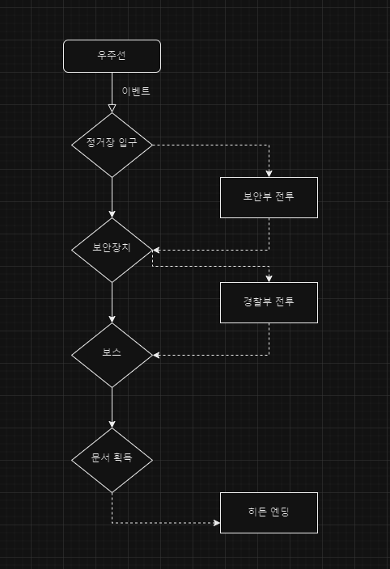

### 서론

프로그래밍의 기초를 배운 후, 간단한 절차적 콘솔 게임을 만들어 보는 프로젝트.

기초 문법 활용 (변수 ~ 구조체)

텍스트 rpg or 퍼즐게임(이동)

### 기획

※ 장르 : Text 어드벤쳐

콘솔 기반이라는 특성 상 이야기에 중점을 두는게 좋을것 같다.

출신에 따른 분기를 생성하고, 특전과 스탯에 따른 전투, 기믹을 수행한다.

※ 플롯

최근에 재밌게 한 게임인 사이버펑크 2077의 엔딩 후 이야기.

V가 크리스탈 팰리스에 임무를 하러 가는 장면에서 게임이 종료되는데,
그 임무를 구현한다.

※ 전체적인 구조

- 주인공의 과거(노마드,기업인,부랑자)에 따른 아이템 보유
- 주인공의 특전에(5가지)에 따른 스탯 설정
- 스탯에 따른 확률로 전투와 기믹 해결
- 자신의 스탯에 따른 확률을 성곡 시키면 전투 회피 가능

~~※ 게임 플로우차트~~

